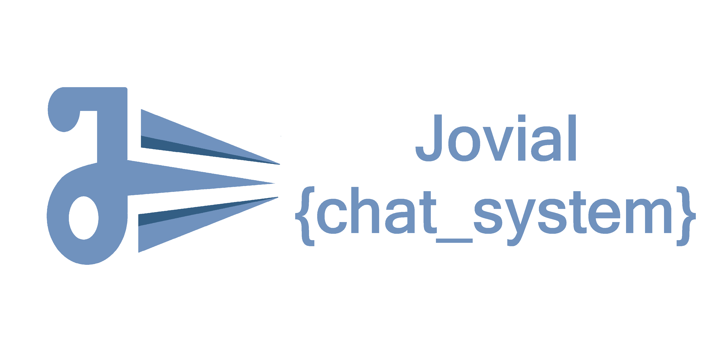

## What is Jovial Chat System?

Jovial Chat System is a **Messaging system** to bring in revolutionary scalability, reliability and Hardware/Network Failure resistance.

This project is meant to allow hosting this messaging system and allow a variety of devices to exploit it and never lose a single message. It follows a strict client identification to ensure secured use of the system.

Jovial Chat system uses a combination of storage systems and data flow mechanisms to ensure ACID-compliant delivery of messages and also ensure storage in a master-less system to prevent any bottlenecks in the Message Life Cycle. Thus allow the reliable collection of messages by the receiver**s**.

(**yes there can be multiple receivers for the same user with proper load balancing**)

## Why Jovial Chat System?

A reliable messaging system can simplify creation of a large number of reliable systems which require a reliable medium for transport of information over the internet, for connecting numerous devices and users, without any scope of failure.

The primary focus of this system is to support a variety of IoT devices and some basic interactive devices/platforms (focusing mainly on the web for now).

Presently a massive number of IoT devices are powered by MQTT, which is lightweight, fast, scalable and supports a variety of devices (ranging from IoT, web browsers, Backend Frameworks & other commonly used systems). But MQTT **lacks** reliability, Hardware & Network Failure resistance, security and loses functionality in the absence of Network.

Reliability, Hardware & Network Failure resistance is/will be a very important requirement of many applications, therefore while preparing them on existing Messaging platforms, one has to make custom arrangements to resolve the gaps, which is often time-consuming and difficult to design and test.

Since Jovial Chat system has an inherent mechanism to identify and sign users using webtokens, the system can securely verify its clients and thus verify senders, receivers and agent of action

## How will Jovial Chat System cover the gaps which exist in current messaging transport systems?

#### Transport | Local Queuing | Triggers

Jovial Chat System has well-defined message delivery flow under a committed Message Delivery life cycle, which takes care of following steps:-

**`Creation`** 🡆 **`Queuing`** 🡆 **`Sending`** 🡆 **`ACID-compliant identity annotation`** 🡆 **`Storage`** 🡆  **`Monitoring`** 🡆 **`Retrieval`** 🡆 **`Collection and Storage`** 🡆 **`on_recive ( listeners/triggers )`**

And also possess well-defined mechanisms to identify and respond, in case of any failure or error in the steps above.

#### Autorization | Verification | DDOS prevention

The Jovial Chat System will not only ensure reliability in terms of message delivery but also security and verification of users. All client devices will have a web token signed with a secret key, this token will allow Servers to identify the clients sending messages and identify clients requesting for messages, which ensure that the messages are delivered only to client devices which are meant to receive them.

This system further performs DDOS prevention measures by identifying abnormal/unwanted traffic and blocking them instantly.

## What is Post Office Model?

Post Office Model is a blueprint which represents all the operations which will be performed by the finished project, in a very simple language, with a very limited technical aspect.

In a Post office model we can represent an idea of a system designed to function if there are NO COMPUTERS, where operations must be 100% manual. 
Doing so, allows us to make the best solution in a very detailed use case. And thus prepare testable codes later.

*We call it Post Office Model, because the Post offices (postal services) can function perfectly without any computer or networking gadget, simply by following a unified system, so if we have to make an e_post_office we can do that project with a 2 centuries old proven action plan*
